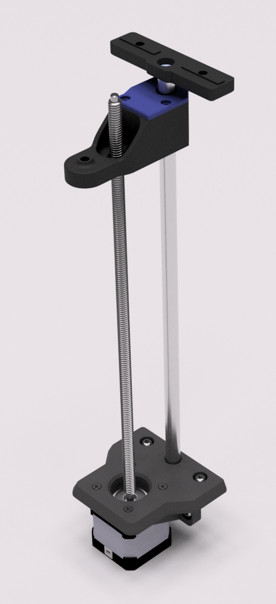
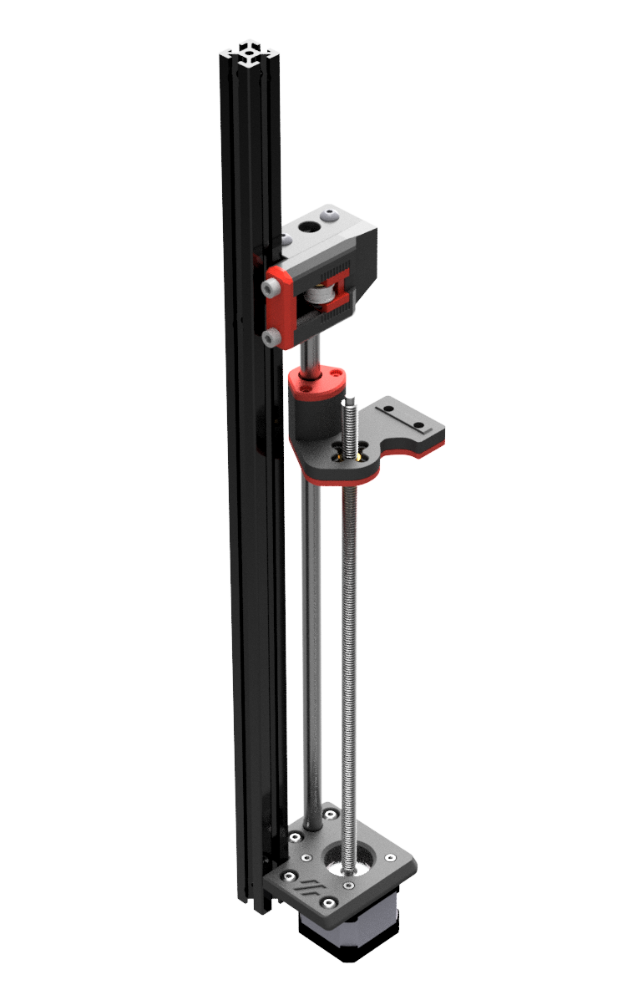

# rodent (Rod Trident)
## Voron Trident with Z rods.

I decided to build a [Voron Trident](https://github.com/VoronDesign/Voron-Trident/) with the scrap materials I have at home. The idea was to spent zero cash (ideally) or as little as possible on this build. I do have the Voron 0.2 already but with its 100x100 build plate, it is not much of a use if I wanted to print cool models to display in my flat. Still, this tiny fella will do me fine for printing most of the parts (the big ones will have to wait until this project is somewhat more complete).

This printer will be my test-bed for something I am thinking of doing: a tool changer. Yay!

### Some notes
For now, I am not anchoring the top ends of the Z-axis stepper motor's lead screws. The thinking is that the rods and stiff bed frame construction should provide enough rigidity to prevent the bed from moving along the vertical axis. Hope this will do. If not, gonna get my thinking hat on and design suitable top latches that won't obstruct the toolhead's pathways. 

The print volume is expected to be about 235x235x260 (possibly 280 on the Z axis, not sure how it plays out yet), using the heated bed from my old Ender 3, 300 mm smooth rods (10 mm diameter), LM10UU bearings. For the Y axis, I am using old MGN12 linear rails @ 300mm length. The extra travel will be used for tool head swaps and nozzle cleaning. The X axis is handled by an old MGN12 linear rail, that's about 270 mm long.

Screenshots from my Fusion 360 files:
1. Z-axis rear (simple enough, I did have to keep in mind the 2020 profile offset caused by the A/B motor mounts)

2. Z-axis for the sides - modelled left side but right side is easily done by just mirroring the STL files by X axis in your slicer

